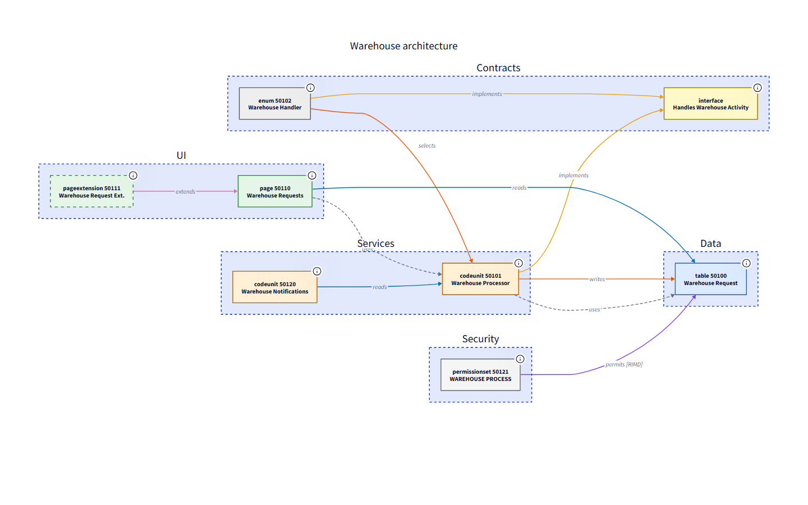
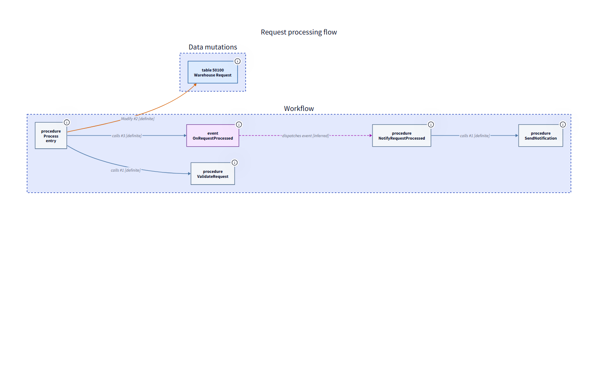
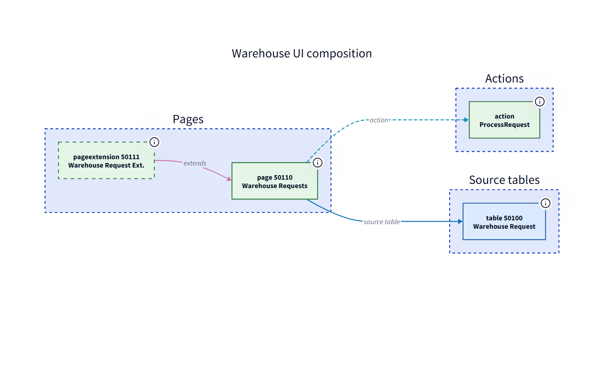

# BC Atlas

[](https://github.com/SchulzOli/ALD2Tree/actions/workflows/ci.yml)
[](./LICENSE)
[](https://nodejs.org/)

Turn a Microsoft Dynamics 365 Business Central AL project into readable
architecture diagrams, focused dependency views, workflow traces, and
executable user documentation.

BC Atlas (`bca`) is an open-source CLI that parses AL source with
[`tree-sitter-al`](https://github.com/SShadowS/tree-sitter-al), builds a small
architecture graph, and writes [`D2`](https://github.com/terrastruct/d2), JSON,
or SVG. The parser and SVG renderer are WebAssembly-based, so the standard
workflow needs only Node.js.

See the [complete CLI command and option reference](./docs/cli-reference.md)
for every command, view, selector, option, default, and configuration setting.

## What it shows

The CLI discovers AL objects and relationships across a project, including:

- extension and customization targets;
- implemented interfaces;
- dependencies expressed through `Record`, object-reference, and database types;
- unresolved targets as external nodes;
- procedure calls, including calls through typed codeunit variables and common
  event-subscriber attributes;
- app metadata from `app.json`, resolution diagnostics, cycles, hubs, and
  orphan objects.

Ten focused views keep larger diagrams useful: `project`, `module`, `object`,
`data`, `call`, `boundary`, `contracts`, `events`, `ui`, and `workflow`.

## Screenshots

These images are generated from the checked-in
[warehouse example](./examples/README.md), using BC Atlas itself.

### Complete architecture



### Workflow and UI views

| Workflow trace | UI composition |
| --- | --- |
|  |  |

The matching editable [D2 and SVG outputs](./examples/output) are committed for
inspection and can be regenerated with `npm run examples`.

## Quick start

Requirements: Node.js 20 or later.

```sh
git clone https://github.com/SchulzOli/ALD2Tree.git
cd ALD2Tree
npm ci
npm link

bca ./path/to/al-project -o architecture.d2
bca ./path/to/al-project -o architecture.svg
```

No native compiler toolchain or separate D2 installation is needed for `.d2`,
`.json`, or `.svg` output. PNG and PDF output requires the optional D2 executable.
You can also run the CLI without linking it:

```sh
node src/cli.js graph ./path/to/al-project --view project -o architecture.svg
```

When `--format` conflicts with the output extension, the format wins:
`-o calls.d2 -f svg` retains `calls.d2` and writes the rendered image to
`calls.svg`.

## Views and inspection

```sh
# Whole project
bca graph ./app --view project -o project.d2

# Aggregated namespace modules
bca graph ./app --view module -o modules.d2

# Folder-based modules instead of namespaces
bca graph ./app --view module --group-by folder -o folders.d2

# One object plus its neighbors
bca graph ./app --view object --object codeunit:50100 -o posting.d2

# Tables and data-oriented references
bca graph ./app --view data -o data.d2

# Procedures, triggers, and syntactically resolvable calls
bca graph ./app --view call -o calls.d2

# Include unresolved/external calls for investigation
bca graph ./app --view call --include-unresolved-calls -o all-calls.d2

# Dependencies crossing a namespace, folder, app, or object boundary
bca graph ./app --view boundary \
  --scope namespace:Contoso.Sales -o boundary.svg

# Interfaces, direct implementations, and enum-mediated implementations
bca graph ./app --view contracts -o contracts.svg

# Event publishers and subscribers
bca graph ./app --view events --focus OnPosted -o events.svg

# Page composition, source tables, actions, and navigation
bca graph ./app --view ui --focus "Sales Order" -o ui.svg

# Trace a generic execution flow from one or more entry points
bca graph ./app --view workflow \
  --entry "ProcessDocument" --entry "action:Release" -o workflow.svg

# Machine-readable graph, diagnostics, app metadata, and insights
bca inspect ./app -o model.json

# Rebuild after AL/config/app.json changes
bca watch ./app --view project -o architecture.d2
```

Filters are repeatable and work in CI:

```sh
bca ./app \
  --namespace "Contoso.Sales.**" \
  --type table,codeunit \
  --exclude "**/test/**" \
  --max-edges 300 \
  -o sales.d2
```

Current views favor readability:

- project diagrams use role lanes (`Data`, `UI`, `Services`, `Contracts`,
  `Security`) unless `--group-by namespace|folder|type` is supplied;
- module diagrams automatically keep the common namespace prefix and expose
  the first meaningful segment; numeric `--module-depth` remains available;
- call diagrams show resolved calls by default;
- data diagrams show table relations and detected reads/writes instead of
  every `Record` declaration;
- object diagrams include field, action, and procedure names for the focused
  object;
- boundary diagrams show inbound and outbound dependencies for repeatable
  `namespace:`, `folder:`, `app:`, and `object:` scopes;
- contract diagrams distinguish direct `implements` relationships from enum
  implementation selection;
- event diagrams connect declared event publishers to subscriber procedures and
  retain unresolved subscriptions;
- UI diagrams separate pages, actions, source tables, parts, and navigation
  targets;
- workflow diagrams start at procedures, triggers, actions, or event publishers
  and combine resolved calls, event dispatch, record mutations, cycles, and
  unresolved branches. Direct call order is labelled `definite`; event
  dispatch and collapsed paths are labelled `inferred`;
- relation colors are consistent across every view: calls are blue, reads are
  dark blue, writes are orange-red, data relations are green, extensions are
  pink, implementations are amber, events are magenta, navigation is green,
  page composition is cyan, and permissions are purple; labels and dash
  patterns remain present so color is never the only signal;
- repeated edges are aggregated and labelled with their count;
- permission-set and codeunit `Permissions` declarations are represented as
  `permits [RIMD]` edges.

Run `bca --help` for the complete CLI reference.

## Examples

The repository includes a self-contained AL project with interfaces, enum
implementations, pages, extensions, actions, events, data mutations, and
permissions. Generate its project, workflow, and UI diagrams with:

```sh
npm run examples
```

See [examples/README.md](./examples/README.md) for the expected outputs and
additional view commands.

## Configuration

Place `.bca.json` at the input root or pass `--config`. Command-line
options override configuration. See
[`.bca.example.json`](./.bca.example.json) for view, layout, filters,
theme, density, and forbidden-dependency policy examples.

Forbidden dependency patterns match
`Namespace:ObjectType:ObjectName`. Policy violations appear in JSON diagnostics
and cause `--strict` to fail when configured as warnings or errors.

Workflow configuration can select entries, label phases, stop traversal, and
collapse utility procedures without relying on a particular domain or naming
scheme:

```json
{
  "view": "workflow",
  "workflow": {
    "entries": ["ProcessDocument", "action:Release"],
    "depth": 8,
    "maxNodes": 100,
    "maxEdges": 250,
    "edgeTypes": ["calls", "events", "writes"],
    "phases": {
      "Validation": ["Validate*", "*.Check*"],
      "Posting": ["Post*", "Finalize*"]
    },
    "stop": ["FinalizeDocument", "event:OnCompleted"],
    "collapse": ["*Telemetry*", "*FeatureFlag*"]
  }
}
```

Pass it explicitly with
`bca graph src --view workflow --config bca.workflow.json`.
Selectors accept exact names, owner-qualified names, `*`/`?` globs, and the
optional `procedure:`, `trigger:`, `action:`, or `event:` prefix. With no
entries, the view infers roots from actions, triggers, event publishers, and
procedures without inbound calls. Reused nodes are emitted once and annotated
when multiple branches converge. The depth, node, edge, and allowed-edge-type
limits apply before rendering and are also reported under `workflow` in JSON.

Open the generated `.d2` file in the D2 playground or render it locally:

```sh
d2 architecture.d2 architecture.svg
```

## Design

The pipeline deliberately separates parsing, semantic extraction, and
presentation:

```text
*.al files -> tree-sitter AL AST -> neutral graph model -> D2 source -> optional image
```

This keeps the core useful without D2 installed and allows additional diagram
views without replacing the parser. See [plan.md](./plan.md) for the roadmap
and design decisions.

## Executable user documentation

The `docs generate` command turns an AL `[Test]` procedure into goal-oriented
Markdown directly. It combines `[SCENARIO]`, `[GIVEN]`, `[WHEN]`, and `[THEN]`
comments with `TestPage` operations to produce concrete page, field, action,
save, and outcome guidance:

```sh
bca docs generate ../app-test/src/PartnerUITest.Codeunit.al \
  --procedure PartnersList_NewPartner_PersistsGeneralFields
```

No browser test or second implementation of the scenario is generated. See the
[AL UI-test documentation guide](./docs/al-ui-test-documentation.md) for source
conventions and CI usage.

## Current limits

This is an architecture extractor, not the AL compiler or language server.
Project-local references are resolved by object type, ID, name, namespace, app
preference, and declared app dependencies. Direct calls, calls through typed
object variables, and common `EventSubscriber` attributes are resolved where
possible. Dynamic calls, interface dispatch, and unusual subscriber forms
remain syntactic/unresolved when the source does not provide enough
information. Conditional compilation branches are represented as parsed by the
grammar rather than evaluated against a symbol set.

## Development

```sh
npm install
npm test
npm run check
node src/cli.js test/fixtures -o example.d2
npm pack --dry-run
```

Container usage:

```sh
docker build -t bc-atlas .
docker run --rm -v "$PWD:/workspace" bc-atlas /workspace -o /workspace/architecture.d2
```

The repository pins the upstream AL grammar artifact in
`vendor/tree-sitter-al.wasm`. Maintainers can update it with
`npm run update:grammar -- <tree-sitter-al tag>`.

## Contributing and support

Contributions are welcome. Start with [CONTRIBUTING.md](./CONTRIBUTING.md), and
read the [Code of Conduct](./CODE_OF_CONDUCT.md). Use the issue forms for bugs
and feature requests, [SUPPORT.md](./SUPPORT.md) for usage help, and
[SECURITY.md](./SECURITY.md) for private vulnerability reporting.

Release notes are maintained in [CHANGELOG.md](./CHANGELOG.md).

## License

[MIT](./LICENSE). Dependencies retain their own licenses: `tree-sitter-al` is
MIT, `web-tree-sitter` is MIT, and D2 is MPL-2.0. See
[THIRD_PARTY_NOTICES.md](./THIRD_PARTY_NOTICES.md).
