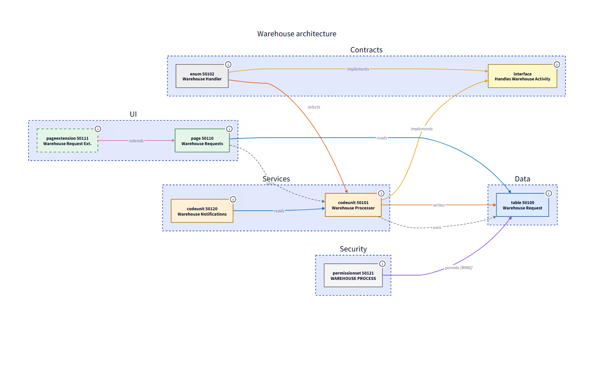
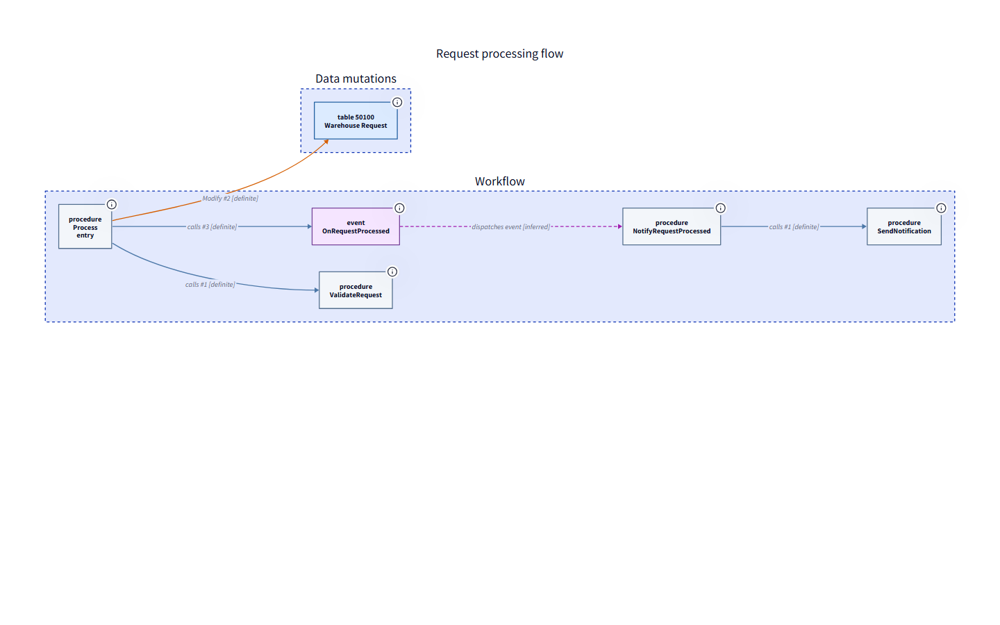
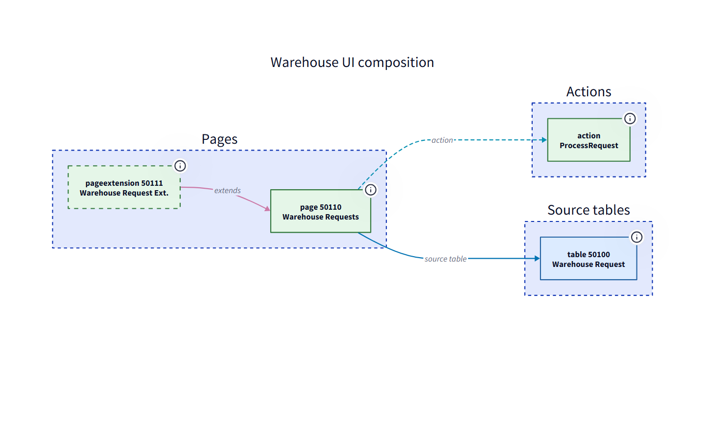

# BC Atlas

[](https://github.com/SchulzOli/BC-Atlas/actions/workflows/ci.yml)
[](./LICENSE)
[](https://nodejs.org/)
[](https://schulzoli.github.io/BC-Atlas/)

**Understand, guard, and document Microsoft Dynamics 365 Business Central AL
projects - straight from source.**

BC Atlas (`bca`) parses AL with
[`tree-sitter-al`](https://github.com/SShadowS/tree-sitter-al), resolves
objects, calls, events, data access, and permissions into an architecture
model, and turns it into diagrams, health checks, reports, and documentation.
Parser and renderer are WebAssembly: Node.js is the only requirement.

**Documentation: [schulzoli.github.io/BC-Atlas](https://schulzoli.github.io/BC-Atlas/)**

```sh
npm install --global bc-atlas
cd path/to/al-project
bca setup     # features, Husky hooks, VS Code tasks, pipeline, schedule (or: bca setup agent)
bca report    # docs/atlas/README.md: overview, diagrams, health
bca check     # architecture gate for CI
bca update    # new version? see what changed and update everything in one step
```

## Features at a glance

| Area | Command | What you get |
| --- | --- | --- |
| **Get started** | `bca setup` | Guided setup in the terminal or through your AI agent (Claude Code, Copilot, Cursor): features, Husky or Git hooks, GitHub Actions or Azure Pipelines, cron schedule, and sync. |
| | `bca init` | A starter `.bca.json`: title, excluded test folders, source links for your Git host. |
| | `bca report` | One Markdown page with an at-a-glance table, six architecture diagrams, and the health summary. [Example](./examples/report/README.md) |
| **Visualize** | `bca graph` | D2, SVG, PNG, PDF, or JSON for ten focused views (below). |
| | `bca watch` | The same diagram, rebuilt on every AL change. |
| **Analyze** | `bca check` | Health findings - cycles, forbidden dependencies, hot spots, diagnostics - with a CI exit code. |
| | `bca inspect` | The resolved architecture model as JSON for scripts. |
| **Document** | `bca codegraph` | One linked Markdown page per AL object. |
| | `bca docs` | User guides and test cases from AL UI tests (`[SCENARIO]`, `[GIVEN]`, `[WHEN]`, `[THEN]`) as Markdown, HTML, DITA 1.3, or Azure DevOps CSV, with real captions and translations. [Example](./examples/docs/index.md) |
| **Integrate** | `bca run` | One entry point for Git hooks, schedules, and pipelines; verifies, stages, or publishes generated files. Also available as a [GitHub Action](./docs/automation-and-ci.md#github-actions). |
| | `bca update` | "BC Atlas 0.8.0 is available": release notes, one-step update, and regenerated hooks, tasks, and pipelines. Dependabot pull requests on request. |
| | `bca capabilities` | A versioned JSON contract of every command for tools and agents. |
| | `bca mcp` | A Model Context Protocol server for AI agents. |

Run `bca` for the same overview in your terminal and `bca help <command>` for
options and examples.

## Views

| View | Answers | Example |
| --- | --- | --- |
| `project` | What does the app contain? | `bca graph --view project -o project.svg` |
| `module` | How do namespaces or folders depend on each other? | `bca graph --view module -o modules.svg` |
| `object` | What surrounds one object? | `bca graph --view object --object codeunit:50100 -o object.svg` |
| `data` | Which code reads and writes which tables? | `bca graph --view data -o data.svg` |
| `call` | Which procedures call each other? | `bca graph --view call --root-procedure Post --call-direction both -o calls.svg` |
| `boundary` | What crosses a namespace, folder, app, or object boundary? | `bca graph --view boundary --scope namespace:Contoso.Sales -o boundary.svg` |
| `contracts` | Which types implement an interface? | `bca graph --view contracts -o contracts.svg` |
| `events` | Which subscribers react to which publishers? | `bca graph --view events --focus OnPosted -o events.svg` |
| `ui` | How do pages, actions, and source tables connect? | `bca graph --view ui --focus "Sales Order" -o ui.svg` |
| `workflow` | What happens after an action or entry point? | `bca graph --view workflow --entry action:Release -o flow.svg` |

### Screenshots

Generated from the checked-in [warehouse example](./examples/README.md).



| Workflow trace | UI composition |
| --- | --- |
|  |  |

## What BC Atlas understands

- extensions and customization targets, implemented interfaces, and
  enum-mediated implementations;
- dependencies through `Record`, object references, and database types;
- procedure calls, including typed codeunit variables, overloads, chained
  calls, and `EventSubscriber` attributes;
- table reads, writes, schema relations, explicit commits, and safe
  cardinality evidence;
- permission sets: table-data `RIMD` rights, execute rights, and composed sets
  across dependent apps;
- pages, parts, actions, and navigation;
- `app.json` metadata, `.alpackages` symbols, multi-app workspaces, cycles,
  hubs, orphans, and unresolved references.

Relationship colors are consistent across views, and labels and dash patterns
ensure that color is never the only signal. Every edge keeps its evidence
(operations, source procedures, locations) in JSON and SVG tooltips.

## Guard the architecture

```sh
bca check --fail-on warning
```

```json
{
  "check": { "failOn": "warning", "cycles": "error", "maxFanIn": 25, "maxFanOut": 25 },
  "forbiddenDependencies": [
    { "from": "Contoso.Core:**", "to": "Contoso.UI:**", "severity": "error", "message": "Core must not depend on UI" }
  ]
}
```

`--format markdown` produces a summary for pull requests or job pages; see
[Automation](./docs/automation-and-ci.md).

## Automate it

`bca setup` asks once and wires everything to `bca run`:

| Trigger | Runs | Typical sync |
| --- | --- | --- |
| VS Code task | Health check (findings in the Problems panel), report, docs, live diagram | - |
| `git commit` (Husky) | Fast checks | - |
| `git push` (Husky) | Report and docs | `verify`: stop when generated files are outdated |
| Pull request / `main` | Everything | `verify` or `artifact` |
| Schedule (cron) | Report and docs | `pull-request` with regenerated files |

New BC Atlas versions show up as a notice in the terminal, as `bca update`, and
optionally as Dependabot pull requests. See [Guided setup](./docs/setup.md).

## Documentation

Read the docs at **[schulzoli.github.io/BC-Atlas](https://schulzoli.github.io/BC-Atlas/)**, with
search, or browse them here, starting with the [table of contents](./docs/_TOC_.md):

- [Getting started](./docs/getting-started.md) and [guided setup](./docs/setup.md), including [staying up to date](./docs/setup.md#staying-up-to-date)
- [Automation: hooks, schedules, and pipelines](./docs/automation-and-ci.md)
- [Architecture reports](./docs/reports.md) and [health checks](./docs/health-checks.md)
- [Architecture diagrams and views](./docs/architecture-diagrams.md)
- [Configuration](./docs/configuration.md) and the complete [`.bca.example.json`](./.bca.example.json)
- [Documentation from AL UI tests](./docs/al-ui-test-documentation.md) and [Code Graph](./docs/code-graph-markdown-design.md)
- [Agent integration and MCP](./docs/agent-integration.md)
- [CLI reference](./docs/cli-reference.md) and [troubleshooting](./docs/troubleshooting.md)
- Generated examples: [architecture report](./examples/report/README.md) and [user guides](./examples/docs/index.md)

## AI agents and tools

```sh
bca capabilities   # versioned JSON contract: argv templates, options, enums, exit codes
bca mcp            # MCP stdio server (also installed as bca-mcp)
```

Agents should read the contract first, pass arguments as arrays, parse stdout
only after a successful exit code, and preview changes with `--dry-run`. The
MCP server exposes inspect, check, report, diagram, documentation, setup, run,
and update-check tools. `bca setup agent --agent claude|copilot|cursor` adds a
`/bca-setup` command that lets your agent guide the setup. See
[agent integration](./docs/agent-integration.md).

## How it works

```text
*.al + app.json + .alpackages
  -> tree-sitter AL syntax tree
  -> objects, members, relations          (analyzer)
  -> resolved model with evidence         (resolver, call analysis, semantics)
  -> view projection and insights         (views, workflow, health)
  -> D2 / SVG / JSON / Markdown           (renderers)
```

Parsing, resolution, projection, and rendering are separate stages, so new
views and outputs do not touch the parser. Every command is defined once in
`src/capabilities.js`; help, argument validation, the JSON contract, and the
generated reference derive from it.

### Current limits

BC Atlas is an architecture extractor, not the AL compiler. References resolve
by object type, ID, name, namespace, app preference, and declared dependencies,
including `.alpackages` symbols. Dynamic calls, interface dispatch, and unusual
subscriber forms stay syntactic or unresolved when the source does not identify
a target. Conditional compilation is represented as parsed, not evaluated.

## Development

```sh
git clone https://github.com/SchulzOli/BC-Atlas.git
cd BC-Atlas
npm ci
npm run check      # syntax check and generated-docs check
npm test
npm run examples   # regenerate examples/output, examples/report, and examples/docs
npm run site:dev   # documentation website with live reload
```

The website is built with VitePress from the Markdown in this repository
(`README.md`, `docs/`, `examples/`) and published to GitHub Pages by the `Docs`
workflow on every push to `main`.

Container:

```sh
docker build -t bc-atlas .
docker run --rm --user "$(id -u):$(id -g)" -v "$PWD:/workspace" bc-atlas report /workspace/app --output-dir /workspace/docs/atlas
```

The AL grammar is pinned in `vendor/tree-sitter-al.wasm`; update it with
`npm run update:grammar -- <tree-sitter-al tag>`. The [roadmap](./ROADMAP.md)
lists planned work.

### Publishing

Releases are published manually through the `Publish npm package` workflow.
Update and commit the version in `package.json` and `package-lock.json`, then
enter that exact version in the workflow form. The workflow rejects mismatched
or already published versions, runs all checks, and publishes with the selected
dist-tag. It requires an `NPM_TOKEN` repository secret. Tag the released
commit as `v<version>` so `uses: SchulzOli/BC-Atlas@v<version>` resolves.

## Contributing and support

Contributions are welcome - see [CONTRIBUTING.md](./CONTRIBUTING.md) and the
[Code of Conduct](./CODE_OF_CONDUCT.md). Use [SUPPORT.md](./SUPPORT.md) for
help and [SECURITY.md](./SECURITY.md) for private vulnerability reports.
Release notes are in [CHANGELOG.md](./CHANGELOG.md).

## License

[MIT](./LICENSE). Dependencies retain their own licenses: `tree-sitter-al` and
`web-tree-sitter` are MIT, and D2 is MPL-2.0. See
[THIRD_PARTY_NOTICES.md](./THIRD_PARTY_NOTICES.md).
