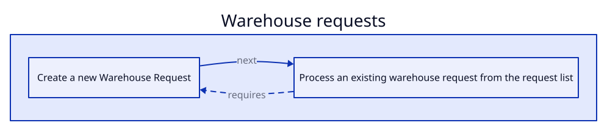

<!-- Generated by BC Atlas docs. Do not edit this file. -->

# BC Atlas Warehouse Example

## Use cases

- [Warehouse requests](./use-case-warehouse-requests.md) (2)

## Scenarios

- [Create a new Warehouse Request](./warehouse-request-create.md)
- [Process an existing warehouse request from the request list](./warehouse-request-process.md)

## Journey

## Scenarios by page

| Page | Scenarios |
| --- | --- |
| Warehouse Requests | [Create a new Warehouse Request](./warehouse-request-create.md), [Process an existing warehouse request from the request list](./warehouse-request-process.md) |

## Scenarios by permission set

| Permission set | Scenarios |
| --- | --- |
| WAREHOUSE PROCESS | [Create a new Warehouse Request](./warehouse-request-create.md), [Process an existing warehouse request from the request list](./warehouse-request-process.md) |

## Coverage

1 of 1 pages are covered by at least one scenario.
