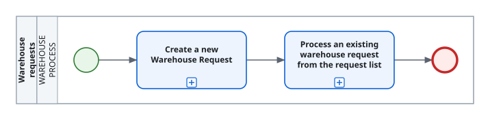

<!-- Generated by BC Atlas docs. Do not edit this file. -->

# Use case: Warehouse requests

## Process

Open [use-case-warehouse-requests.bpmn](./use-case-warehouse-requests.bpmn) in a BPMN modeler such as Camunda Modeler or bpmn.io to edit the process; double-click a scenario to see its steps.

## Main scenario

1. [Create a new Warehouse Request](./warehouse-request-create.md)
2. [Process an existing warehouse request from the request list](./warehouse-request-process.md)
