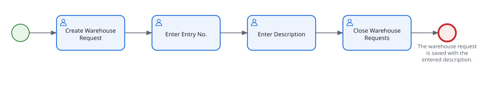

<!-- Generated by BC Atlas docs from WarehouseUITests.al#WarehouseRequests_CreateRequest_PersistsDescription. Do not edit this file. -->
<!-- Source SHA-256: 723224931c0f46093e43ec4676c2ef06da865a49ead55f29f73bc0d692e3f70e -->

# Create a new Warehouse Request

Use this guide to create a new Warehouse Request.

## At a glance

## Before you start

- Required permission: **WAREHOUSE PROCESS**
- Required state: No warehouse request exists for entry number 10000.

## Steps

> The values below are examples from the automated UI test. Use values appropriate for your environment.

1. Choose the 🔍 icon, enter **Warehouse Requests**, and then choose the related link. Choose **New** to create a record.
2. In the **Entry No.** field, enter a value, for example **10000**. _Specifies the number that identifies the warehouse request._
3. In the **Description** field, enter a value, for example **Receive summer stock**. _Specifies what the warehouse needs to do._
4. Close the **Warehouse Requests** page. Business Central saves your changes.

## What should happen

- The warehouse request is saved with the entered description.

## Next steps

- [Process an existing warehouse request from the request list](./warehouse-request-process.md)

Source and verification

- File: `WarehouseUITests.al`
- Function: `WarehouseRequests_CreateRequest_PersistsDescription`
- Source SHA-256: `723224931c0f46093e43ec4676c2ef06da865a49ead55f29f73bc0d692e3f70e`

