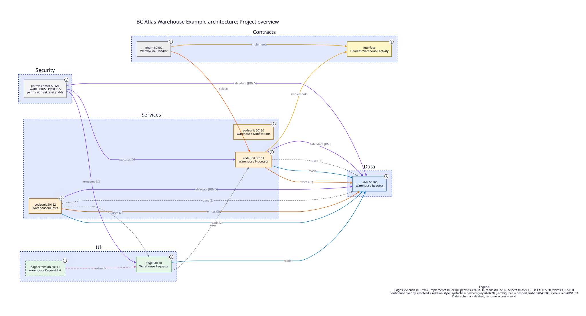
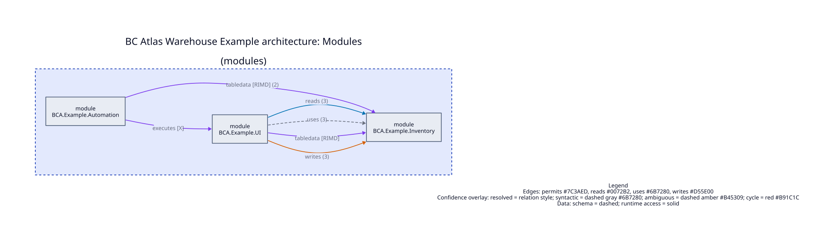
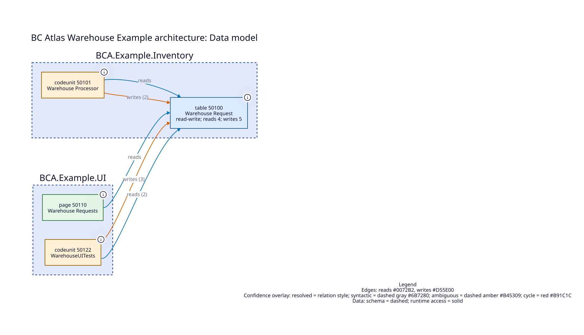
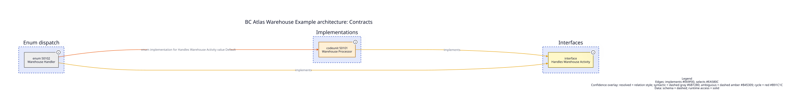
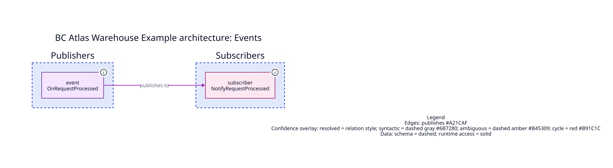
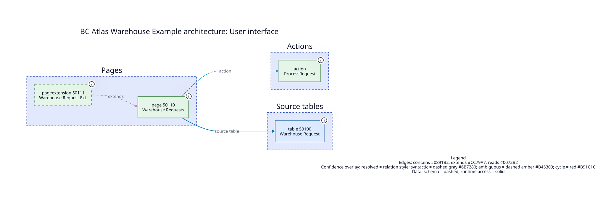

<!-- Generated by BC Atlas. Do not edit; rerun the command below instead. -->

# BC Atlas Warehouse Example architecture

**BC Atlas Warehouse Example** 1.0.0.0 by BC Atlas contributors

## At a glance

| Files | Objects | Relationships | Unresolved | Cycles | Health |
| --- | --- | --- | --- | --- | --- |
| 4 | 9 | 26 | 0 | 0 | Passed (0 errors, 0 warnings) |

## Contents

- [Project overview](#project-overview)
- [Modules](#modules)
- [Data model](#data-model)
- [Contracts](#contracts)
- [Events](#events)
- [User interface](#user-interface)
- [Architecture health](#architecture-health)
- [Object catalog](objects/index.md) - 9 object pages

## Project overview

AL objects grouped into role lanes (Data, UI, Services, ...).



9 nodes, 26 edges. Source: [project.d2](project.d2)

## Modules

Aggregated namespace or folder dependencies.



3 nodes, 6 edges. Source: [module.d2](module.d2)

## Data model

Tables with reads, writes, relations, and extensions.



4 nodes, 5 edges. Source: [data.d2](data.d2)

## Contracts

Interfaces and their direct or enum implementations.



3 nodes, 3 edges. Source: [contracts.d2](contracts.d2)

## Events

Event publishers and subscribers.



2 nodes, 1 edges. Source: [events.d2](events.d2)

## User interface

Pages, source tables, parts, actions, and navigation.



4 nodes, 3 edges. Source: [ui.d2](ui.d2)

## Architecture health

**Passed** - 0 error(s), 0 warning(s), 1 info. Fails on: `error`.

| Metric | Value |
| --- | --- |
| Apps | BC Atlas Warehouse Example 1.0.0.0 |
| Files | 4 |
| Objects | 9 |
| Relationships | 26 |
| Unresolved references | 0 |
| Dependency cycles | 0 |

| Object type | Count |
| --- | --- |
| codeunit | 3 |
| enum | 1 |
| interface | 1 |
| page | 1 |
| pageextension | 1 |
| permissionset | 1 |
| table | 1 |

**Most connected objects**

| Object | Used by | Depends on |
| --- | --- | --- |
| codeunit 50101 Warehouse Processor | 3 | 2 |
| page 50110 Warehouse Requests | 3 | 2 |
| table 50100 Warehouse Request | 4 | 0 |
| permissionset 50121 WAREHOUSE PROCESS | 0 | 3 |
| codeunit 50122 WarehouseUITests | 0 | 2 |
| enum 50102 Warehouse Handler | 0 | 2 |
| interface Handles Warehouse Activity | 2 | 0 |
| pageextension 50111 Warehouse Request Ext. | 0 | 1 |

| Severity | Rule | Finding |
| --- | --- | --- |
| Info | `orphan-objects` | 1 object(s) without relationships: codeunit 50120 Warehouse Notifications |

## Regenerate

```sh
bca report examples/warehouse-app --output-dir examples/report --codegraph
```

_4 AL file(s) analyzed. Result: PASSED - 0 error(s), 0 warning(s), 1 info (fail on: error)._
